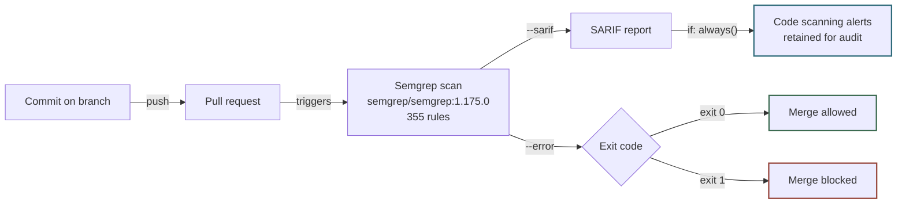
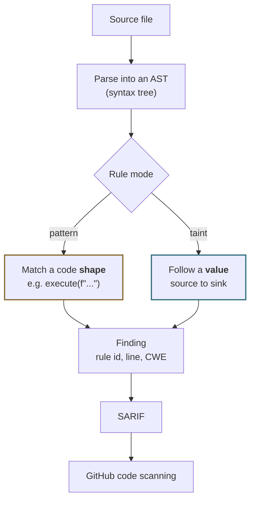

# CRA_Test

Evaluation of **Semgrep Community Edition** as a blocking pull request gate.

Semgrep CE is free and open source under **LGPL 2.1**
([source](https://github.com/semgrep/semgrep)). No account, no licence, no seat
cost. This repository is the evidence that it works, and the record of where it
does not.

> **Warning**
> Several branches here contain **deliberately vulnerable code**. They are test
> fixtures so the gate has known defects to catch. Nothing here is deployed or
> imported by any system. Do not copy from them.

## How the gate works

Every pull request runs Semgrep in a container. One scan drives two independent
outputs: the SARIF evidence path, and the exit code that decides the merge.



The `if: always()` guard is the part that matters. The SARIF upload runs even
when the gate fails, so a red build still files its alerts. A naive gate fails
at the scan step and throws the evidence away, leaving you blocked with nothing
to show an auditor.

## How Semgrep decides something is a finding

Semgrep is not grep. It parses each file into a syntax tree and matches rules
against that tree, so formatting, variable names and comments do not affect it.
Rules come in two shapes, and the difference explains both its strengths and the
blind spot documented below.



**Pattern rules** match a shape. They are fast and precise, but they only catch
the shapes the rule author wrote down. **Taint rules** follow a value from a
source (say `request.args`) to a dangerous sink (say `execute`), so they catch
the flaw regardless of the shape in between. Taint rules are the stronger tool,
and in the OSS engine they do not follow a value across files.

## The tests, one by one

Each branch isolates one question. The point of the passing branches is as
important as the failing ones: a gate that blocks everything gets switched off
within a week.

### `main` and `feat/asset-inventory`: does it block ordinary work?

A small but real service: a Flask HTTP API over PostgreSQL with connection
pooling, an allow list for sortable columns, and bound parameters on every
query. Twelve files of the kind of code a team actually writes.

**Result: 0 findings.** This is the number to care about. A scanner that cries
wolf on correct code costs more than it saves, because developers learn to
ignore it. Semgrep stayed silent here.

### `feat/asset-search`: SQL injection

Adds a search endpoint that builds its query by pasting user input straight into
the SQL text:

```python
query = (
    "SELECT id, name, criticality, updated_at FROM assets "
    f"WHERE name ILIKE '%{term}%' ORDER BY {sort}"
)
cur.execute(query)
```

`term` and `sort` come from the URL. Because they are pasted into the query text
rather than passed as parameters, a visitor controls the SQL itself, not just
the values in it. `?sort=name; DROP TABLE assets` is a valid request. This is
**CWE-89**, the most damaging and most common flaw in database-backed
applications.

The correct version, on `main`, passes values as bound parameters so the
database never confuses data with instructions:

```python
cur.execute("... WHERE name ILIKE %s ORDER BY updated_at", (term,))
```

**Result: caught, but only after a custom rule was added.** See the next
section: this is the most important finding in the whole evaluation.

### `feat/asset-pagination`: a false positive, handled properly

Adds paging and sorting. The code is correct: the sort column is resolved
through an allow list and composed by psycopg as an `Identifier`, which is the
textbook safe way to make a column name dynamic.

Semgrep flagged it anyway, with a rule written for **SQLAlchemy**, a different
database library. The rule is simply wrong here. This branch shows the accepted
way to overrule the scanner: suppress the one named rule, write down why, and
record it in [`SUPPRESSIONS.md`](SUPPRESSIONS.md) with a date and a revisit
trigger.

**Result: passes, with one documented accepted finding.**

### `feat/report-export`: three more vulnerability classes

Adds report caching and shipping, containing three distinct flaws:

| Code | Flaw | Plain English |
|---|---|---|
| `pickle.load(fh)` | Insecure deserialization (**CWE-502**) | `pickle` rebuilds Python objects from a file, and a crafted file can run commands while being loaded. Reading pickle you did not write is equivalent to running a program you did not write. |
| `requests.post(..., verify=False)` | Disabled certificate validation (**CWE-295**) | Turns off the check that you are talking to the real server. Anyone positioned on the network can read and alter the traffic, which defeats the point of HTTPS. |
| `subprocess(..., shell=True)` | Shell injection (**CWE-78**) | The argument is handed to a shell, so characters like `;` and `|` become commands. User input reaching this runs arbitrary commands on the server. |

**Result: 4 findings, merge blocked.**

### `demo/vulnerable-endpoint`: the original smoke test

The first proof that the pipeline works end to end: a small file with command
injection, `eval` on user input, MD5 hashing and Flask debug mode left on.
9 findings.

### Summary

| Branch | Tests | Expected |
|---|---|---|
| `main` | Clean baseline | pass |
| `feat/asset-inventory` | Realistic service, 12 files | pass |
| `feat/asset-search` | SQL injection | fail |
| `feat/asset-pagination` | Correct work plus documented suppression | pass |
| `feat/report-export` | pickle, TLS off, shell injection | fail |
| `demo/vulnerable-endpoint` | Original smoke test | fail |

## A real miss, and how it was closed

The public rulesets **did not catch** the SQL injection in `feat/asset-search`.
Identical SQL, identical injection, only the line wrapping differs:

```python
query = f"SELECT id, name FROM assets WHERE name ILIKE '%{term}%'"
# 2 findings

query = (
    "SELECT id, name FROM assets "
    f"WHERE name ILIKE '%{term}%'"
)
# 0 findings
```

`formatted-sql-query` is a pattern rule, and its pattern is a single string
literal. SQL assembled from adjacent literals across lines does not match that
shape, and that is how anyone writes SQL longer than one line.

The gap is closed by [`.semgrep/sql.yml`](.semgrep/sql.yml), a **taint** rule
that follows the formatted value into `execute()` wherever it was built. Custom
rules are free in CE. Verified in both directions: it catches the wrapped form
and stays silent on the parameterized baseline.

## Known limitations

| Gap | Consequence |
|---|---|
| Hardcoded secrets are not detected | Semantic secret scanning is the paid product. Pair with gitleaks. |
| Path traversal in `load_report` was missed | Filesystem sinks have thinner coverage than injection sinks. |
| No cross-file taint analysis | Interfile analysis is a Pro Engine feature. |

Semgrep CE is a strong free first filter that catches whole classes of real
defects. It is not a complete application security programme, and this table is
here so nobody mistakes it for one.

## Suppressing a finding

Public rules are sometimes wrong. `sqlalchemy-execute-raw-query` fires on
psycopg code in `feat/asset-pagination`. The accepted way to handle that:

1. Suppress the **specific rule id**, never a bare `# nosemgrep`, which would
   hide every future finding on that line.
2. Put the reason and a date in a comment beside it.
3. Add a row to [`SUPPRESSIONS.md`](SUPPRESSIONS.md).

A suppression is a decision with an owner, not a way to make CI green.

## Glossary

Terms used above and in the GitHub interface, in plain language.

| Term | What it means |
|---|---|
| **SAST** | Static Application Security Testing. Analysing source code for flaws without running it. The opposite is DAST, which tests a running application. |
| **Semgrep CE** | Community Edition. The free, open source engine, LGPL 2.1. **Pro Engine** is the paid tier, whose main addition is cross-file analysis. |
| **Rule** | One check, written as a code pattern plus a message and metadata. |
| **Ruleset** | A named bundle of rules. `p/default` and `p/python` are public bundles pulled from Semgrep's registry at scan time. |
| **AST** | Abstract Syntax Tree. The structured form of code after parsing. Semgrep matches against this rather than raw text, so spacing, comments and variable names do not fool it. |
| **Pattern rule** | Matches a code *shape*. Fast and precise, but blind to shapes the author did not anticipate. |
| **Taint rule** | Follows a *value* from where it enters to where it is used. Catches the flaw regardless of the code shape in between. |
| **Source** | Where untrusted data enters, for example `request.args`. |
| **Sink** | Somewhere dangerous that data should not reach unsanitised, for example `cur.execute` or `subprocess`. |
| **Bound parameter** | Passing a value to the database separately from the SQL text, so it can never be read as an instruction. The fix for SQL injection. |
| **False positive** | The scanner reports a problem that is not real. Costs trust and developer time. |
| **False negative** | The scanner misses a real problem. Costs you a breach. Section above documents three. |
| **SARIF** | Static Analysis Results Interchange Format. An OASIS standard JSON format for scanner output. GitHub ingests it from any tool, so findings appear on the diff and persist as tracked alerts. |
| **CWE** | Common Weakness Enumeration. The industry catalogue of flaw types. CWE-89 is SQL injection. Gives auditors a shared vocabulary. |
| **OWASP Top 10** | The ten most critical web application risk categories, revised periodically. Commonly referenced in compliance frameworks. |
| **Code scanning** | GitHub's built-in findings dashboard, under the Security tab. Free for public repositories. |
| **Exit code** | The number a command returns. `0` means success, anything else means failure. `--error` makes Semgrep return `1` when it finds something, which is what fails the check. |
| **`nosemgrep`** | A comment that suppresses a finding on the following line. Always name the specific rule id. |
| **Blocking finding** | One that fails the build, as opposed to being reported for information only. |

## Run it yourself

```sh
docker run --rm -v "$PWD:/src" semgrep/semgrep:1.175.0 \
  semgrep scan --config=p/default --config=p/python \
               --config=.semgrep/ --metrics=off --error /src
```

Exit code 0 means clean, 1 means findings. That is the whole gate.
